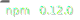

# [💡 Witney](https://github.com/witneyjs/witney)

---

Don't wait to start with your javascript and typescript projects.

Read [Getting started](http://www.witneyjs.com/getting_started.html) to learn how to start using Witney for your next projects.

## Features

- 📦 Bundles with [microbundle](https://github.com/developit/microbundle)
- 🧹 Formatting with [prettier](https://github.com/prettier/prettier)
- 👨🏼‍⚖️ Typescript support with [ts-node](https://github.com/TypeStrong/ts-node) and [ts-jest](https://github.com/kulshekhar/ts-jest)
- 📏 Tests and coverage with [jest](https://github.com/facebook/jest)
- 🧢 Markdown site generation with [mallery](https://github.com/malleryjs/mallery/)
- 🎰 Versioning with [standard-version](https://github.com/conventional-changelog/standard-version)
- 🧰 Packed with commonly used dev scripts
  - All written with 🧩 extensibility in mind
  - Scripts for Building, Testing, Coverage, Server starting
  - 🔖 Badges generator
  - 🧐 Dependency license check
  - 👽 Dependency gyp check
